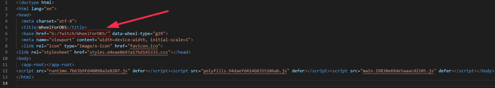
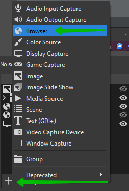
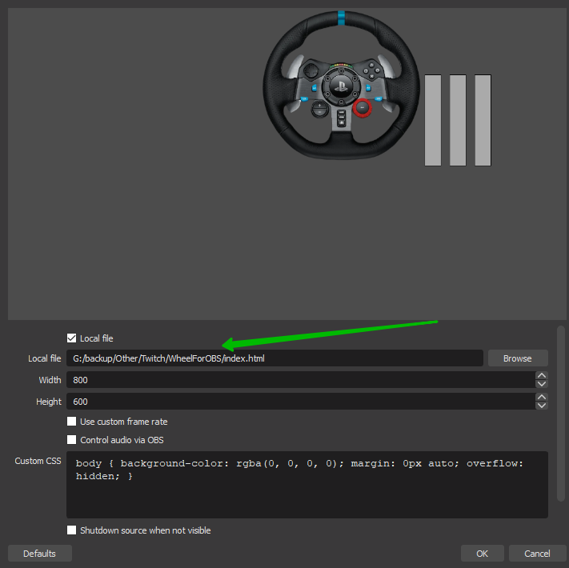

# Steering wheel for OBS
> Supported only g29 
> I don't have other steering wheel for testing 
> It may work, but it's not certain

### How to add a steering wheel to OBS
1. You need to download the compiled site [Archive link](https://drive.google.com/file/d/1QwgIVLdMNGgr6gxakMy3QNxs386YUJqg/view?usp=sharing)
2. Unpack the archive and place the folder in a convenient place
3. Open in the unzipped folder index.html with a text editor
4. Specify the local path to the site 
5. Add local site to OBS

Next, you can already configure the steering wheel window in OBS

> This project was created with [Angular CLI](https://github.com/angular/angular-cli) version 11.2.5.
